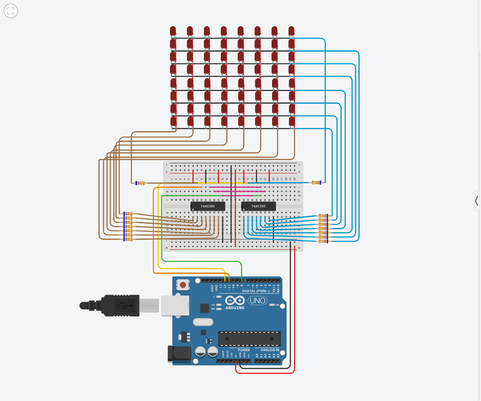

# Arduino 8x8 LED Matrix Animations and Projects

A collection of text displays, visual animations, and game-inspired projects for an **8x8 LED matrix** controlled by an Arduino and **two 74HC595 shift registers**.

This repository contains the individual Arduino sketches for each effect. The examples are intended for learning LED matrix multiplexing, bitmap graphics, animation, and simple game development on resource-constrained microcontrollers.

## Breadboard Circuit

## Hardware

- Arduino board
- 8x8 LED matrix
- 2x 74HC595 shift registers
- Current-limiting resistors
- Breadboard
- Jumper wires

Depending on the project, additional input devices such as push buttons, potentiometers, or a joystick can be added.

## Project Contents

### Text Displays

The matrix can display letters, numbers, symbols, and scrolling messages.

Included text demonstrations:

- `Hello, Gio`
- `This is LED Matrix`
- Alphabet `A-Z`
- Numbers `1-9`

Because an 8x8 matrix has limited space, longer messages are displayed using scrolling text. Individual characters can also be shown one at a time using pixel-font patterns.

### Basic Animations

The LED matrix can also be used for different visual effects, including:

- Horizontal scanner
- Vertical scanner
- Bouncing pixel
- Expanding square
- Filling animation
- Digital rain
- Random stars
- Checkerboard
- Moving diagonal
- Pulse animation

These examples demonstrate frame generation, timing, movement, and LED matrix multiplexing.

## Game Animations

Several classic games can be represented on an 8x8 display despite the low resolution.

### Pong

A miniature Pong animation with two paddles and a bouncing ball.

It can be expanded into an actual two-player game by adding buttons, potentiometers, or joysticks for paddle control.

### Snake

A small Snake animation where the body is represented by individual LEDs.

It can be expanded with:

- Player controls
- Random food generation
- Snake growth
- Collision detection
- Scoring
- Game-over screen
- Restart functionality

### Tetris

Simple Tetromino-like blocks can fall through the matrix.

A more complete version could include:

- Multiple Tetromino shapes
- Block rotation
- Left and right movement
- Collision detection
- Line clearing
- Increasing speed
- Score tracking

### Space Invaders

Pixel-art alien frames can be alternated to reproduce the classic Space Invaders movement.

A playable version could add:

- Player ship
- Shooting
- Moving enemies
- Enemy projectiles
- Lives
- Score

### Pac-Man

Pac-Man can be represented using small open-mouth and closed-mouth frames.

The concept could be expanded into a tiny maze game with dots, ghosts, and player controls.

## Recommended Expansion: Mini Arduino Game Console

One of the best ways to expand this project is to turn the LED matrix into a **miniature Arduino game console**.

A possible hardware setup could include:

- Arduino
- 8x8 LED matrix
- 2x 74HC595 shift registers
- Analog joystick or directional buttons
- One or two action buttons
- Buzzer for sound effects
- Start/reset button

The console could contain a simple game-selection menu and several games such as:

1. Snake
2. Pong
3. Tetris
4. Space Invaders
5. Breakout
6. Flappy Bird
7. Dino Runner
8. Maze
9. Racing
10. Asteroids

A menu could allow the player to select a game using the joystick and launch it using an action button.

## Other Project Recommendations

### LED Matrix Digital Sign

Turn the matrix into a programmable miniature sign capable of displaying:

- Names
- Messages
- Notifications
- Symbols
- Numbers
- Status indicators

Multiple 8x8 matrices could later be chained together to create a much wider scrolling display.

### Mini Animation Player

Store several pixel animations in program memory and automatically cycle through them.

Possible animations include:

- Heartbeat
- Fire
- Fireworks
- Rain
- Loading indicators
- Faces
- Arrows
- Radar
- Spiral
- Waves
- Character sprites

### Pixel Art Display

Use the matrix as a tiny monochrome pixel-art screen.

Sprites could include:

- Game characters
- Animals
- Logos
- Icons
- Emoticons
- Vehicles
- Spacecraft

### Conway's Game of Life

The 8x8 matrix can run a small implementation of Conway's Game of Life.

Each LED represents one cell, allowing the Arduino to calculate and display each new generation automatically.

This is a useful project for combining programming concepts with visual output.

### Reaction-Time Game

Display a random LED after a random delay and measure how quickly the player presses a button.

Possible features:

- Reaction time measurement
- Best score
- Countdown
- False-start detection
- Difficulty levels

### Memory Game

Display a sequence of directions or LEDs and require the player to reproduce the sequence using buttons or a joystick.

The sequence can become longer after each successful round.

### Dice and Random Number Display

Use a button to generate random values and display them using LED patterns.

Possible modes include:

- Digital dice
- Random number generator
- Coin flip
- Decision picker

### Music Visualizer

With additional audio-input circuitry, the matrix could display simple patterns responding to sound.

Examples include:

- Audio level meter
- Spectrum-inspired animation
- Beat indicator
- Pulsing patterns

### Sensor Dashboard

Instead of using the matrix only for animations, it can display information from sensors.

Examples:

- Temperature
- Humidity
- Light level
- Distance
- Counter values
- Warning symbols
- Device status

### Serial-Controlled Display

Connect the Arduino to a computer through USB serial and allow the computer to send text, patterns, or commands to the matrix.

For example, a PC application could send a message and the Arduino could scroll it across the display.

This could later become a small desktop notification display.

## Advanced Ideas

After experimenting with the Arduino version, the project can be extended further.

### Multiple LED Matrices

Chain several 8x8 matrices together to create displays such as:

- 8x16
- 8x24
- 8x32
- 16x16

A larger display makes scrolling text and games significantly more practical.

### Custom Graphics Library

Instead of keeping display logic inside every sketch, create a reusable Arduino library containing functions for:

- Drawing pixels
- Drawing lines
- Drawing rectangles
- Displaying sprites
- Displaying characters
- Scrolling text
- Clearing the screen
- Frame timing

This would allow future projects to use simpler high-level commands.

### Framebuffer

Maintain an 8-byte framebuffer representing the complete display.

Each bit represents one LED, allowing game logic and animation code to modify the virtual screen before it is rendered.

This is similar to how larger graphical displays and game engines manage screen contents.

### Interrupt-Based Display Refresh

The current display can eventually be improved by using hardware timers to refresh the matrix automatically.

This separates display multiplexing from game logic and makes animations and input handling easier to manage.

### Sound

Adding a piezo buzzer can provide simple sound effects for:

- Menu navigation
- Scoring
- Collisions
- Shooting
- Game over
- Startup sounds

This would make the game-console version considerably more interactive.

## Learning Goals

This project can be used to practice:

- Arduino programming
- C/C++ fundamentals
- Bitwise operations
- Binary representation
- Shift registers
- LED multiplexing
- Framebuffers
- Pixel graphics
- Animation
- Timing
- State machines
- Game loops
- Input handling
- Embedded systems programming

## Future Direction

The project can start as a collection of simple LED matrix demonstrations and gradually evolve into a more complete embedded system.

A practical development path is:

**LED patterns → animations → text rendering → reusable graphics functions → input controls → playable games → game menu → mini game console**

The same concepts can later be transferred to larger LED matrices, OLED displays, LCDs, ESP32 boards, Raspberry Pi Pico boards, and other embedded display projects.

## Notes

LED matrix modules can have different row/column orientations and common-anode/common-cathode configurations. Some sketches may therefore require adjustments to row order, column order, or output inversion depending on the specific matrix and wiring.

This project is intended for learning, experimentation, and embedded systems development.

The examples may be modified and extended for personal or educational projects.
